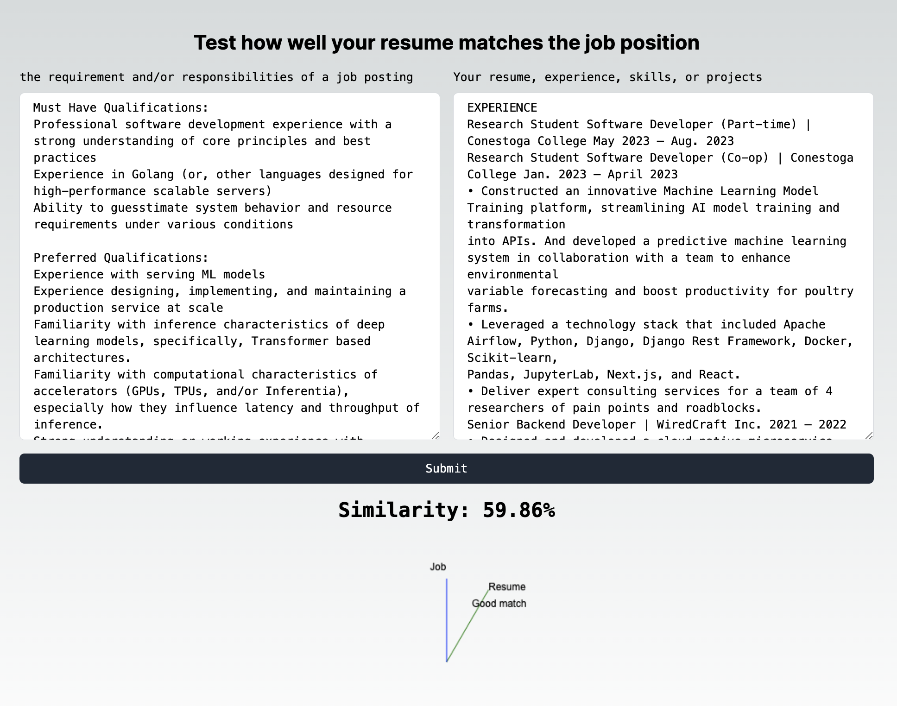
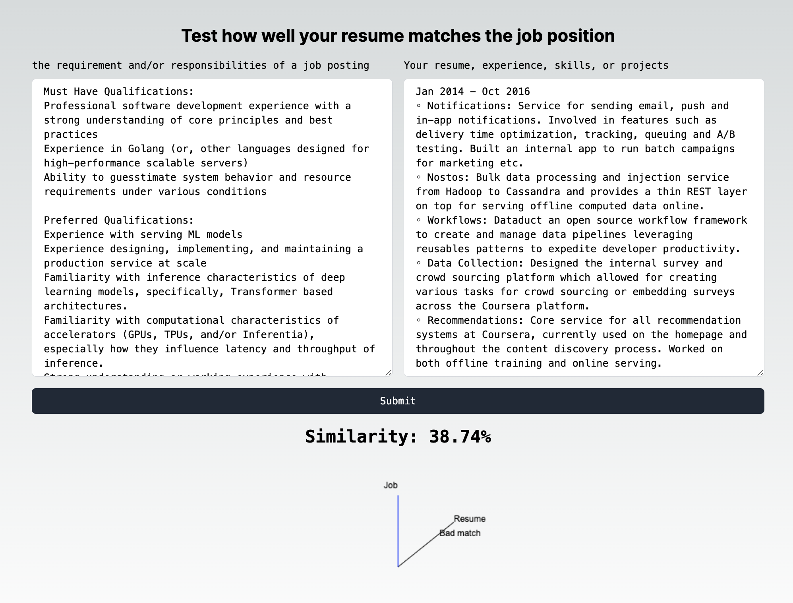

# Cohere test

This demo is to use Cohere embedding API to test how well a resume matches a job position.




## Tech stack

* Python 3.11
* FastAPI
* Nodejs
* React
* Cohere embedding API

## Explaination

Using Cohere embedding API to get the embedding of the resume and job description, then calculate the cosine similarity between them. The higher the similarity, the better the match since the cosine similarity has lower sensitivity to the length of the text.

Note:

* This project is just for demo purpose, so not using any best practice.

## How to run

* Docker installed

```
make up
```

to remove all the containers, images, and volumes, run

```
make clean
```

[http://localhost:8000/docs#/](http://localhost:8000/docs#/) to see the swagger UI of the backend API
[http://localhost:3000/](http://localhost:3000/) to see the frontend UI